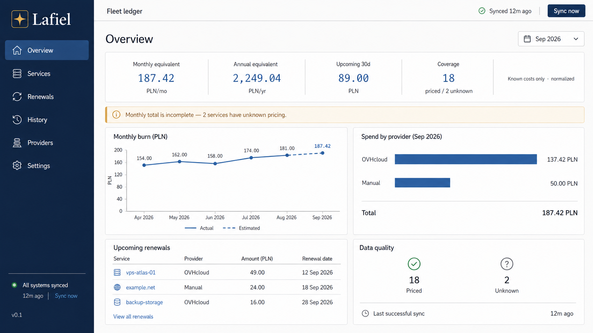
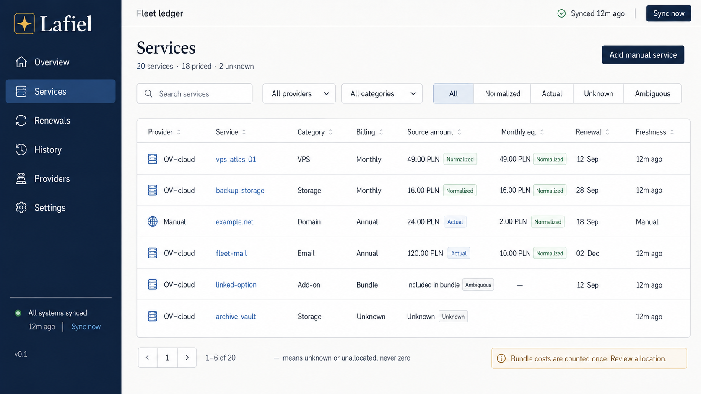
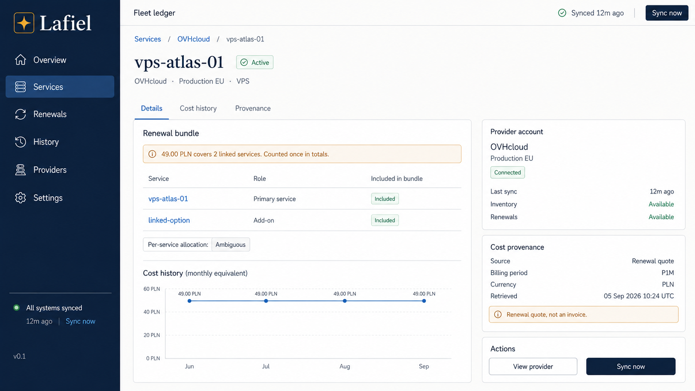
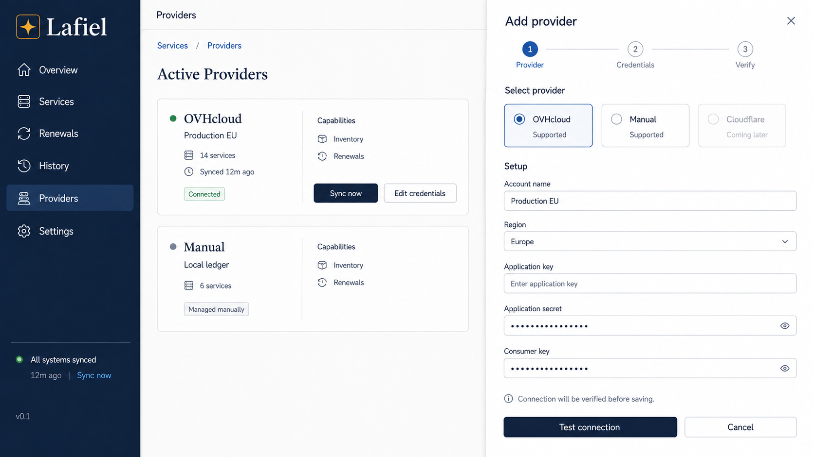
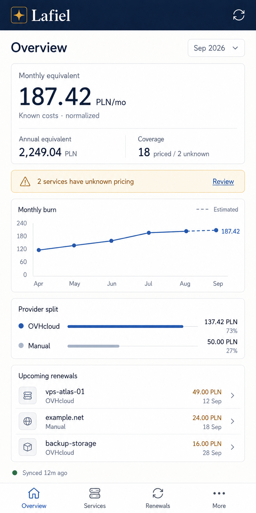
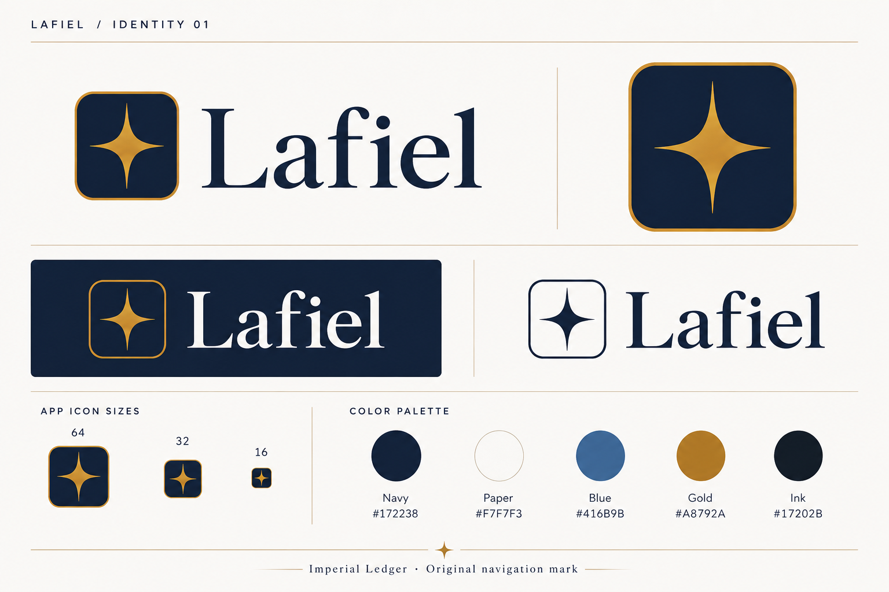

# Imperial Ledger design system

> Source: AFFiNE page `Projekt wizualny: Lafiel — Imperial Ledger`. This repository copy is authoritative for UI implementation. Implement from the tokens and behavior below; mockups are illustrative, not pixel-perfect contracts.

## Direction

Imperial Ledger is a calm shipboard administrative terminal translated into a modern web application: cool ink, paper-like panels, precise lines, royal navy, muted telemetry blue, and one warm attention accent.

Avoid generic fintech, Grafana, cyberpunk, purple-gradient SaaS, anime wallpaper, franchise symbols, copied Seikai UI/assets, Abh script, mascots, and character illustrations. “Lafiel” is the product name and an easter egg, not a fan site.

## Semantic tokens

### Light palette

| Role | Value |
| --- | --- |
| `--canvas` | `#F7F7F3` |
| `--surface` | `#FFFFFF` |
| `--surface-subtle` | `#F0F1ED` |
| `--surface-command` | `#172238` |
| `--surface-selected` | `#E5ECF3` |
| `--text-primary` | `#17202B` |
| `--text-secondary` | `#52606E` |
| `--text-muted` | `#7B8794` |
| `--text-on-command` | `#F7F7F3` |
| `--text-link` / `--info` | `#416B9B` |
| `--line` | `#D7DDE3` |
| `--line-strong` | `#AEBBC8` |
| `--line-command` | `#31435F` |
| `--action-primary` | `#22314C` |
| `--action-primary-hover` | `#172238` |
| `--attention` / `--renewal-soon` | `#A8792A` |
| `--danger` | `#B64A52` |
| `--success` | `#3F7963` |
| `--cost-actual` | `#17202B` |
| `--cost-estimate` | `#416B9B` |
| `--cost-normalized` | `#52606E` |
| `--cost-unknown` | `#7B8794` |

Gold means attention or an approaching renewal. Red means an error or destructive action, not “cost is high.” Green means healthy/successful. Provider brand color never communicates status.

### Dark palette (prepared, out of v1)

`canvas #0E1522`, `surface #151F30`, `subtle #1C293D`, `command #0A101B`, `text #EDF1F5`, `secondary #AAB6C3`, `line #304056`, `blue #7FA5CF`, `gold #D1A85C`. Avoid pure black.

## Typography

- Manrope 400/500/600/700 for UI.
- IBM Plex Mono 400/500/600 with tabular figures for data.
- Serif is limited to the wordmark.
- Display: 32/38, 700.
- H1: 24/30, 700. H2: 18/24, 700.
- Body: 14/21. Label: 12/16, 600.
- Data: 13/18 mono, 500. Primary cost: 36/40 mono, 600.

## Geometry and spacing

- 8 px rhythm; spacing scale 4/8/12/16/24/32/48.
- Card radius 10 px; control radius 8 px.
- Pills only for status and tags.
- 1 px borders and minimal shadows.
- Minimum hit area 44 px.
- Desktop max width 1440 px; command rail 240 px.
- Dense table rows remain 44–48 px tall.
- No glassmorphism or large gradients.

The recurring motif is a thin segmented “fleet line” with restrained markers in headers and charts. It is abstract telemetry, not a franchise symbol. The wordmark is `Lafiel` or `LAFIEL`, accompanied by the brand roundel (`public/favicon.svg` — gold four-point star on the navy roundel, shared with the favicon and every `<x-app-logo-icon>` usage); charts and line motifs keep the abstract fleet line instead of the star.

## Application shell

Desktop-first responsive layout with a navy command rail:

```text
Overview
Services
Renewals
History
Providers
Settings
```

Place sync state and version at the bottom. Key workflows must remain usable on a phone.

### Overview

Header: `Lafiel / Fleet ledger` plus last sync. Primary metrics: monthly spend, annual equivalent, renewals within 30 days, and coverage (for example `18 priced / 2 unknown`). Then show spend history, provider split, upcoming renewals, and clear unknown/stale messages.

### Services and details

Columns: Provider, Service, Category, Billing, Source amount, Monthly equivalent, Renewal, Freshness. Details expose evidence origin, source references, package membership, and history.

### Providers

Account cards show connection state, service count, last sync, and health per capability (Inventory, Renewals, Subscriptions, Usage, Invoices). Actions are Sync now, Edit credentials, and Disable. Do not display adapters that do not exist.

## Charts

- Use a line chart for monthly spend history.
- Use a donut only when it materially helps comparison.
- Tooltips show source currency/amount and normalized PLN equivalent.
- Actual and estimated data differ by label and style, not color alone.
- Avoid animation that impairs reading.

## States and copy

- Empty: `No costs yet. Add a provider or a manual service.`
- Incomplete: `Monthly total is incomplete — pricing is unknown for 2 services.`
- Stale: `OVH data was last updated 3 days ago.`
- Auth failure: `OVH credentials were rejected. Existing history is unchanged.`
- Success: `Fleet ledger synchronized.`
- Renewal: `Renewal window: 3 services / 30 days.`

Unknown and incomplete states are product features. Never hide them behind an apparently precise total.

## Visual reference assets

The AFFiNE source contains six illustrative PNG concepts:

1. `01-overview-desktop.png` (1672×941)
   
2. `02-services.png` (1672×941)
   
3. `03-service-details-ovh.png` (1672×941)
   
4. `04-providers-add-provider.png` (1672×941)
   
5. `05-overview-mobile.png` (887×1774)
   
6. `06-logo-wordmark-sheet.png` (1536×1024)
   

They are illustrative examples with sample data. The semantic tokens and behavioral requirements in this document win over mockup pixels. The source PNGs live under `docs/assets/imperial-ledger/` and use stable repository-relative paths.

## Anti-patterns

ThemeForest admin templates, neon/cyberpunk, anime art, purple gradient SaaS, “AI insights,” red charts merely because spend increased, excessive KPI cards, 11 px data tables, raw colors scattered through Blade, or any presentation that hides uncertainty.

